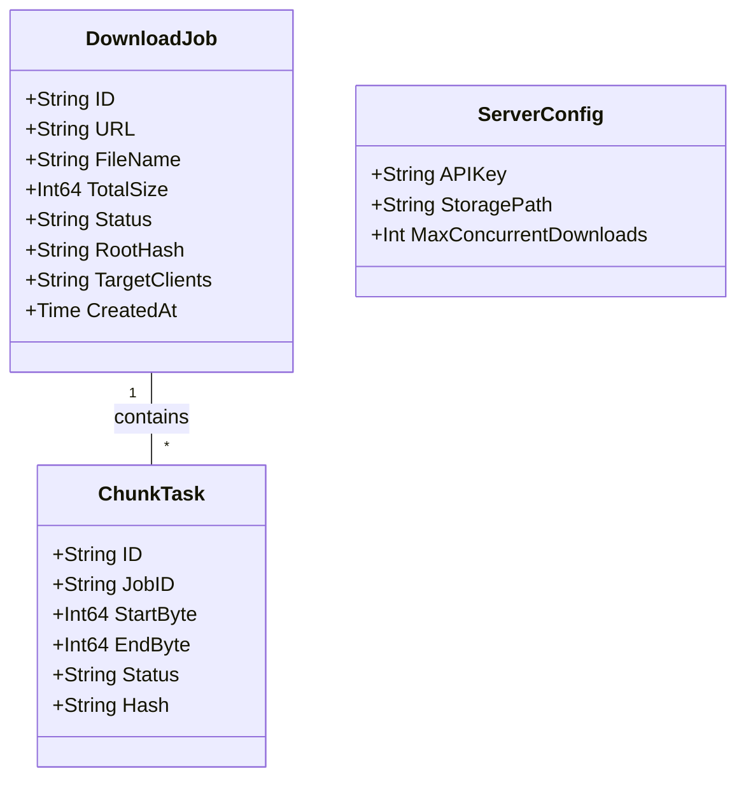

# Server Core Download Engine

## Requirements
Implement the MachDown server core to handle asynchronous, chunk-based concurrent downloads with Merkle Tree integrity verification, SQLite persistence, and API Key authentication, serving as the central hub for the browser extension and desktop client.

## Entities

## Approach
1. API Design:
   - RESTful JSON API using standard `net/http` ou framework leve.
   - Authentication via custom middleware checking `X-API-Key` header.
   - Server-Sent Events (SSE) endpoint for real-time progress broadcasting.

2. Technical Implementation:
   - Go `goroutines` and `sync.WaitGroup` for concurrent chunk downloading using HTTP `Range` headers.
   - Pure Go SQLite driver (`modernc.org/sqlite`) to avoid CGO dependencies.
   - Deduplication: HTTP HEAD request to check `ETag`/`Content-Length` before starting a download. If identical file exists, duplicate DB record pointing to same physical file, else append version number to filename.

3. Business Logic:
   - **Merkle Tree**: Calculate SHA-256 for each chunk *during* the download stream (`io.TeeReader`). Build tree in memory and persist structure.
   - **Compression (Bandwidth Saver)**: To save client bandwidth without breaking HTTP Range requests, the server will implement a background task that compresses highly compressible downloaded files (using Zstandard/Gzip) *on disk* before generating the final Merkle Tree for the Client. The Client will download the compressed file and decompress it locally.
   - **Sync Intent**: Desktop Clients will register a unique `ClientID` with the server upon installation. The Extension will fetch these IDs and send a specific `TargetClients` array (e.g., ["desktop-pc-id"]) to the Server, resolving the AutoSync conflict precisely without relying on MAC addresses.

## Structure

### Dependencies
1. `APIController` calls `DownloadService`
2. `DownloadService` depends on `JobRepository`, `ChunkDownloader`, and `MerkleVerifier`
3. `ChunkDownloader` depends on `DiskManager`

### Layered Architecture
1. Controller Layer: HTTP handlers, request validation, SSE streaming.
2. Service Layer: Core logic, orchestration of goroutines, deduplication checks.
3. Repository Layer: SQLite CRUD operations for `DownloadJob` and `ChunkTask`.
4. Storage Layer: `DiskManager` handling OS file creation, sparse files, and chunk merging.

## Operations

### Create APIKey Middleware
1. Responsibility: Validate `X-API-Key` header against `ServerConfig`.
2. Methods:
   - `RequireAuth(next http.Handler)`: `http.Handler`
     - Logic: Read header. If empty or invalid, return 401 Unauthorized. Else, proceed.

### Implement DownloadService - EnqueueDownload
1. Responsibility: Start the deduplication check and enqueue a new job.
2. Core Methods: 
   - `Enqueue(url string, cookies string, targetClients []string)`: `*DownloadJob, error`
     - Logic:
       - Execute HTTP HEAD to `url`.
       - Check DB for existing job with same ETag. If exists, create symlink or shared reference.
       - If new, create `DownloadJob` (Status: Pending) in DB.
       - Launch `ProcessJob` asynchronously.

### Implement ChunkDownloader
1. Responsibility: Download a specific byte range and hash it.
2. Core Methods: 
   - `DownloadChunk(job *DownloadJob, chunk *ChunkTask)`: `error`
     - Logic:
       - Create HTTP GET request with `Range: bytes={Start}-{End}`.
       - Read body stream through `io.TeeReader` hashing with SHA-256.
       - Write to sparse file at specific offset.
       - Update DB `ChunkTask` status and hash.

## Norms
1. Concurrency: Always use `sync.WaitGroup` to track active chunk downloads and prevent goroutine leaks.
2. Error Handling: Return wrapped errors with context (e.g., `fmt.Errorf("downloading chunk %s: %w", id, err)`).
3. DB Access: Use parameterized queries to prevent SQL injection.
4. Structs: Use JSON tags for DTOs and GORM tags for DB models.

## Safeguards
1. Memory Constraints: Limit chunk buffer size (e.g., 4MB-8MB) to prevent OOM when downloading 50 chunks concurrently.
2. Security: Never log sensitive headers (Cookies, API Key).
3. Disk Constraints: Abort download if disk space is < 5%.
4. Network: Respect 429 Too Many Requests by implementing exponential backoff in `ChunkDownloader`.
